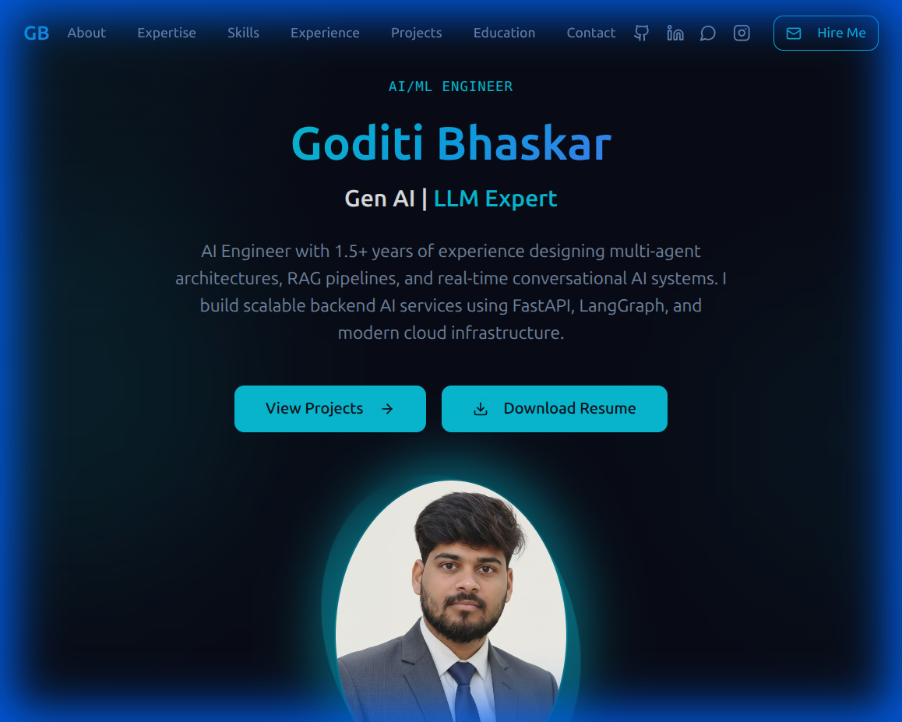

<div align="center">

# Goditi Bhaskar — AI/ML Engineer Portfolio



[](https://bhaskargoditi.dev)
[](https://www.linkedin.com/in/bhaskar-goditi-7169b0240)
[](https://github.com/bhaskarchowdary826)

> **Personal portfolio of Goditi Bhaskar** — AI Engineer specializing in multi-agent architectures, RAG pipelines, and real-time conversational AI systems.

</div>

---

## ✨ Features

- 🎨 **Dark, modern design** — premium glassmorphism, gradients, and micro-animations
- 🖱️ **Interactive cursor glow** — ambient radial gradient follows mouse, zero re-renders via `requestAnimationFrame`
- ⚡ **Smooth animations** — powered by Framer Motion with scroll-triggered reveal sections
- 📱 **Fully responsive** — optimized for all screen sizes and devices
- 🧩 **Modular component architecture** — built with ShadCN UI + Tailwind CSS
- 🔗 **Direct GitHub links** — every project links to its real repository

---

## 🗂️ Sections

| Section | Description |
|---|---|
| **Hero** | Name, title, bio, and CTA buttons |
| **About** | Background and personal introduction |
| **Core Expertise** | Key AI/ML capability areas |
| **Skills** | Technology stack with visual skill bars |
| **Experience** | Professional work history timeline |
| **Projects** | Featured builds + noteworthy projects |
| **Education** | Academic background timeline |
| **Contact** | Contact form + social links |

---

## 🚀 Featured Projects

| Project | Stack | Repo |
|---|---|---|
| **WEDNES AI** — No-Code AI Agent Builder | FastAPI · PostgreSQL · Celery · Redis · React | [View →](https://github.com/Prashanth-TechAI/WEDNES-AI-Backend) |
| **DocuMind** — Document Q&A RAG Platform | FastAPI · Next.js · LangChain · Groq · FAISS | [View →](https://github.com/bhaskarchowdary826/DocuMind) |
| **AI Calling Agent** — Real-Time Voice AI | FastAPI · WebSockets · OpenAI Realtime · Twilio | *Coming soon* |
| **JD Scraper** — Lead Generation Platform | Next.js · Python · Selenium · FastAPI | [View →](https://github.com/bhaskarchowdary826/JDScrapper) |
| **Blog Writing Agent** — Multi-Agent Content System | LangGraph · FastAPI · GPT-4o-mini · SerpAPI | [View →](https://github.com/bhaskarchowdary826/Blog_Writing_Agent) |
| **AI Safe Drive** — Driver Monitoring System | Python · TensorFlow · OpenCV · Dlib | [View →](https://github.com/bhaskarchowdary826/AI_SAFE-DRIVE) |

---

## 🛠️ Tech Stack

```
Frontend       React 18 · TypeScript · Vite · Tailwind CSS · ShadCN UI
Animations     Framer Motion · CSS Keyframes
State          TanStack Query · React Hook Form · Zod
Routing        React Router DOM v6
Icons          Lucide React
Fonts          Google Fonts (system UI stack)
```

---

## 📦 Getting Started

### Prerequisites
- Node.js ≥ 18
- npm or bun

### Installation

```bash
# Clone the repository
git clone https://github.com/bhaskarchowdary826/bhaskar-goditi.git
cd bhaskar-goditi

# Install dependencies
npm install --legacy-peer-deps

# Start the development server
npm run dev
```

The app will be available at **http://localhost:8080**

### Build for Production

```bash
npm run build
```

---

## 📁 Project Structure

```
src/
├── components/          # All UI sections and shared components
│   ├── ui/              # ShadCN + custom UI primitives
│   ├── Hero.tsx
│   ├── About.tsx
│   ├── Projects.tsx
│   ├── Education.tsx
│   ├── Experience.tsx
│   ├── CursorGlow.tsx   # Ambient mouse-tracking glow effect
│   └── ...
├── hooks/
│   └── use-mouse-position-ref.ts
├── pages/
│   └── Index.tsx        # Main single-page layout
└── assets/
    └── profile-photo.png
```

---

## 📬 Contact

| Channel | Link |
|---|---|
| **Email** | [bhaskargoditi@gmail.com](mailto:bhaskargoditi@gmail.com) |
| **LinkedIn** | [bhaskar-goditi-7169b0240](https://www.linkedin.com/in/bhaskar-goditi-7169b0240) |
| **WhatsApp** | [+91 78529 10316](https://wa.me/917852910316) |
| **Instagram** | [@bhas_kar.009](https://www.instagram.com/bhas_kar.009) |

---

<div align="center">

Designed & Built by **Goditi Bhaskar** · © 2025

</div>
